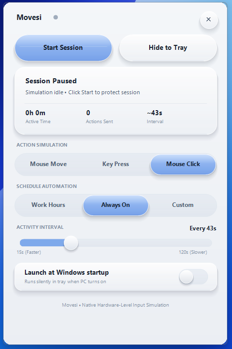

# Movesi

<p align="center">
  
</p>

<p align="center">
  <strong>A lightweight, zero-dependency session protection utility with an authentic 3D Liquid Glass UI.</strong>
</p>

---

Movesi keeps your PC awake and prevents session timeouts, screen lockouts, and sleep interruptions (like when downloading large Steam games overnight or running long renders) by simulating micro-user activity at randomized intervals.

> *I built this because I didn't want my Steam downloads to pause when my PC went to sleep. Windows uses way too much RAM, so I wanted something ultra-light that uses practically 0% CPU and almost no memory while I'm away.*

---

## ✨ Highlights

- 💎 **3D Liquid Glass Interface**: Styled with molded acrylic platters, periwinkle glass pills, smooth spring physics, and an interactive 3D toggle switch.
- 🪶 **Featherweight (< 1 MB RAM)**: Written in native Win32 C++ with dynamic memory trimming (`EmptyWorkingSet`), sipping just **~0.6 MB of RAM** and compiling to a single **~150 KB** standalone executable.
- 🐭 **Simulation Modes**:
  - **Mouse Move**: 10–20px relative displacement to reset OS idle timers without interfering with work.
  - **Key Press**: Sends virtual `VK_F15` (a dead key on modern systems that won't disrupt gaming or typing).
  - **Mouse Click**: In-place mouse clicks.
- ⏱️ **Smart Schedules**: Choose between **Work Hours** (9 AM – 5 PM M–F), **Always On**, or custom schedules.
- 🚀 **Silent Startup**: Single-click toggle to launch silently into the system tray on Windows boot.
- 🔒 **100% Private & Offline**: Zero network calls, zero tracking, zero external runtimes (no Electron, no .NET, no WebView).

---

## 🛠️ Build & Run (Windows)

### Requirements
- MinGW / GCC (`g++` and `windres` on your `PATH`, e.g. via MSYS2 or MinGW-w64).

### Compiling
Run the included build script:
```cmd
build.bat
```
This produces a single standalone binary: **`Movesi.exe`**.

### Usage
- **Double-click `Movesi.exe`**: Opens the liquid glass interface.
- **Top Header**: Drag from anywhere on the header bar to move the window.
- **Start / Pause Session**: Toggle protection at any time.
- **Hide to Tray (✕ / Button)**: Docks Movesi to the taskbar notification tray.
- **Tray Icon**:
  - *Left-click*: Restore window.
  - *Right-click*: Quick toggle, schedule selection, or Quit.

---

## 🍎 macOS Version (SwiftUI)

Movesi also includes a native macOS menu bar status agent:

```bash
swiftc -O \
  -sdk "$(xcrun --show-sdk-path --sdk macosx)" \
  -o Movesi \
  macos/MovesiApp.swift macos/StatusController.swift
```

> **Note**: Grant Accessibility permissions to your Terminal application in **System Settings > Privacy & Security > Accessibility** to allow event simulation.

---

## 📄 License
MIT License. Free and open source.
