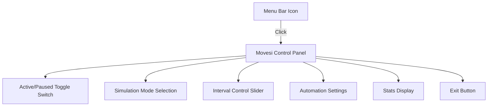

# Movesi for macOS: User Guide

Welcome to the **Movesi** user guide for macOS. Movesi is a lightweight utility that runs in your system menu bar to prevent your Mac from sleeping, locking, or timing out. It works by simulating micro-actions at randomized intervals.

This guide will walk you through launching the app, granting the necessary macOS permissions, and understanding the user interface.

---

## 1. Getting Started

### How to Run the App
Unlike normal applications, Movesi runs as an **accessory/agent application**. 
* When you launch the app, **no icon will appear in your Dock**, and **no main window will open**.
* Instead, it launches directly into your **macOS Menu Bar** (the top right section of your screen near the clock).
* Look for a circular icon:
  * **Green solid dot (●)**: Session protection is currently **Active** (preventing sleep).
  * **Empty outline ring (○)**: Protection is **Paused**.

---

## 2. Granting System Permissions (Important)

macOS implements strict security controls to protect your system. Because Movesi simulates mouse and keyboard inputs to keep your session active, you must grant it permissions. The app will show clear warnings in the menu bar panel if these are missing.

> [!IMPORTANT]
> Since this compiles to a standalone command-line binary (`Movesi`) rather than a packaged `.app` bundle, macOS attributes its activity to the **Terminal** or shell application that launched it (such as `Terminal.app`, `iTerm.app`, or `VS Code`). Therefore, **you must grant Accessibility and Screen Recording permissions to your Terminal application** rather than to the `Movesi` binary itself.

### Step 1: Grant Accessibility Access
This allows the simulator to post keypresses and mouse movements.
1. When you open the Movesi menu bar panel, click **Grant Accessibility Access**, or open **System Settings** manually.
2. Go to **Privacy & Security** > **Accessibility**.
3. Click the `+` button, select your **Terminal** app (or shell runner, e.g. `Terminal.app` or `iTerm.app`), and toggle the switch to **On**.
4. Authenticate using your password or Touch ID.

### Step 2: Grant Screen Recording Access (macOS 14+ Sonoma and later)
On newer versions of macOS, the operating system requires screen recording authorization to let apps calculate mouse coordinates accurately.
1. In the Movesi panel, click **Grant Screen Recording Access**.
2. Alternatively, navigate to **System Settings** > **Privacy & Security** > **Screen Recording**.
3. Toggle the switch for your **Terminal** app to **On**.
4. *Note: Movesi does not record, store, or transmit your screen data. This permission is solely used to calculate mouse coordinates locally.*

---

## 3. Using the Interface

Click the **Movesi** circular icon in your menu bar to open the settings panel.

### Control Panel Settings
* **Active/Paused Toggle**: The green switch at the top activates or pauses the session protection.
* **Simulation Mode**:
  * **Move**: Performs invisible micro-movements of your mouse pointer.
  * **Click**: Simulates a left-click at the current position of the pointer.
  * **Key**: Simulates a keypress. This defaults to the Spacebar (keycode `49`) to ensure universal keyboard support, but can be configured in the UI to any virtual keycode (e.g., `113` for `F15`).
* **Interval Slider**: Set how frequently (between 5 and 120 seconds) Movesi should simulate user activity.
* **Stats Panel**: Displays how long you have been active in the current session and the total number of actions simulated.
* **Automation Settings**:
  * **Work Hours**: When enabled, automatically turns the app on between 9:00 AM and 5:00 PM, Monday through Friday.
  * **Blackout**: Automatically pauses the app on weekends and during nights (6:00 PM to 9:00 AM) to let your screen lock and system sleep naturally.
* **Exit**: Click the **Exit** button at the bottom of the panel to close the application completely.

---

## 4. How to Uninstall

If you wish to remove Movesi:
1. Click the Movesi icon in the menu bar and click **Exit**.
2. Drag the `Movesi` file/app to the **Trash**.
3. Go to **System Settings** > **Privacy & Security** > **Accessibility**, select `Movesi`, and click the minus (`-`) button to remove it.
